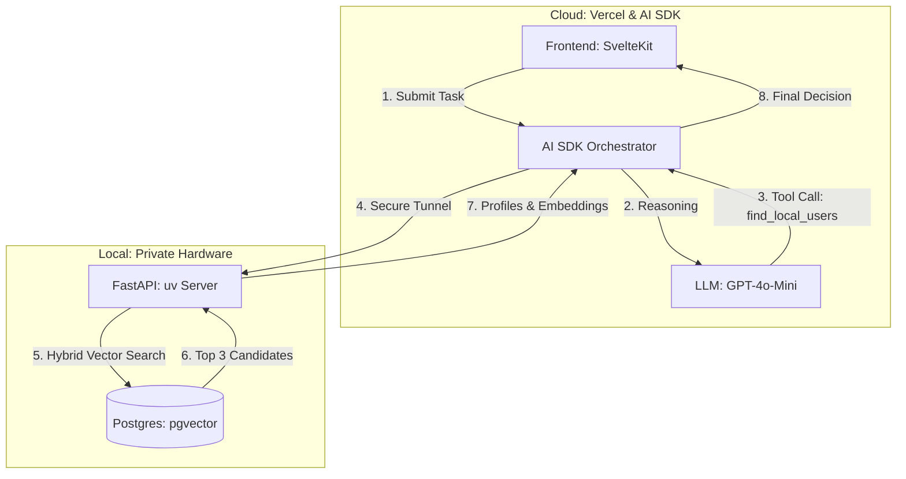

# Agentic-System (Hybrid POC)

**A Privacy-First, Event-Driven Agentic System for Intelligent Task-User Matching.**

- **The Project:** Retrieving **User Profiles** from a private local vault to match a cloud-originating **Task**.
- **The Agent:** Hosted on Vercel, utilizing the **Vercel AI SDK** to coordinate between cloud LLMs and your local hardware.
- **The Tech:** SvelteKit (Vercel) + FastAPI (Local `uv`) + Pydantic AI + Local Postgres (`pgvector`).

### 1. The Hybrid Architecture

To ensure data privacy and high-speed local retrieval, the "Search" happens on the hardware, while the "Reasoning" happens at the Edge.



### 2. Local Backend Setup (`uv` + FastAPI)

We use `uv` for ultra-fast dependency management. The backend serves as a "Specialized Tool" for the cloud agent.

**Installation (Local):**

```bash
# Initialize with uv
mkdir backend && cd backend
uv init
uv add fastapi uvicorn pgvector psycopg[binary] openai pydantic-settings

```

**Local Vector Schema:**

```sql
-- Enable locally
CREATE EXTENSION IF NOT EXISTS vector;

CREATE TABLE users (
    id SERIAL PRIMARY KEY,
    name TEXT NOT NULL,
    skills TEXT[],
    profile_embedding vector(1536) -- Managed locally for privacy
);

```

---

### 3. Frontend Orchestration (Vercel AI SDK)

The frontend on Vercel acts as the "Brain." It uses the `maxSteps` feature to "loop": it calls your local machine, gets the users, and then renders the final recommendation.

**Orchestration Logic:**

```typescript
// Vercel Edge Function
export const POST = async ({ request }) => {
  return streamText({
    model: openai('gpt-4o-mini'),
    maxSteps: 5,
    tools: {
      searchLocalVault: tool({
        description: 'Query the local pgvector database for matching users',
        execute: async ({ embedding }) => {
          const res = await fetch('YOUR_TUNNEL_URL/search-users', { ... });
          return res.json();
        }
      })
    }
  });
};

```

### 4. Hybrid Optimization Strategy

| Strategy           | Implementation                                  | Benefit                                                           |
| ------------------ | ----------------------------------------------- | ----------------------------------------------------------------- |
| **Privacy Vault**  | Keep `pgvector` and raw bios on Local Postgres. | **Security:** Sensitive data never lives on cloud servers.        |
| **uv Environment** | Use `uv` to manage local Python dependencies.   | **Speed:** Instant startup and reproducible environments.         |
| **Tool Calling**   | LLM uses `find_local_users` as a specific tool. | **Precision:** The LLM only sees the data it explicitly asks for. |
| **Edge Reasoning** | Host Agent on Vercel Edge.                      | **Latency:** Final UI rendering happens closest to the user.      |
