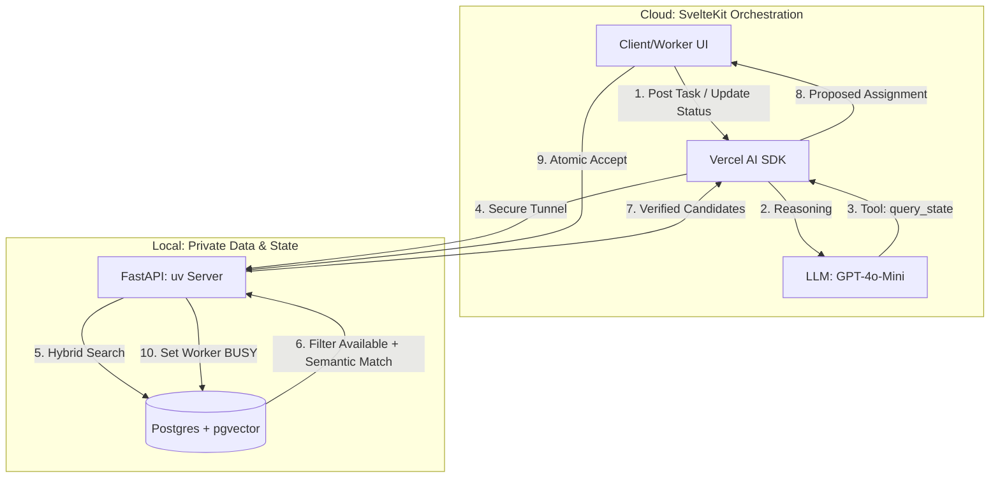

# Agentic-System (Hybrid Dispatch POC)

**A Real-Time, Privacy-First Agentic System for Dynamic Task-Worker Matching.**

- **The Project:** A dynamic dispatch engine that matches Clients' tasks to the best available Workers using semantic intelligence.
- **The Engine:** Local FastAPI server managing the "Source of Truth" (Worker status & Vector embeddings).
- **The Orchestrator:** Vercel-hosted SvelteKit using the **Vercel AI SDK** to reason over system state and suggest assignments.

### 1. Hybrid Architecture & Event Flow

The system separates **Reasoning** (Cloud LLM) from **Authoritative State** (Local Postgres). This ensures the Agent always knows who is `available` before suggesting a match.



### 2. Local "Source of Truth" (Postgres + pgvector)

We combine **Relational State** (Availability) with **Vector Search** (Skills). This prevents the Agent from assigning a worker who is already busy.

### 3. The "Vault" API (FastAPI + Pydantic AI)

We use **Pydantic AI** tools to allow the Agent to "see" inside the local database.

**Hybrid Search Logic:**

### 4. Critical Design Principles

| Strategy            | Implementation                                                  | Benefit                                                                                |
| ------------------- | --------------------------------------------------------------- | -------------------------------------------------------------------------------------- |
| **Hybrid Search**   | Filter `status = 'available'` in SQL _before_ the vector match. | **Precision:** Prevents the LLM from hallucinating assignments for busy workers.       |
| **Atomic Claiming** | `UPDATE tasks SET worker_id = X WHERE worker_id IS NULL`.       | **Safety:** Prevents "Race Conditions" where two workers claim the same task.          |
| **State Awareness** | Agent must call `get_available_candidates` tool every time.     | **Real-time:** Ensures the Agent uses the latest updates before generating a response. |
| **Local Vault**     | All PII (Names, Bios, Skill vectors) stays on local hardware.   | **Privacy:** Only minimal candidate IDs are sent to the Cloud LLM.                     |

### 5. Full Setup Guide (Clone → Run)

#### Prerequisites

| Tool | Install |
|---|---|
| Python 3.11+ | https://python.org |
| [uv](https://docs.astral.sh/uv/) | `pip install uv` |
| Docker Desktop | https://docker.com |
| Node.js 18+ | https://nodejs.org |
| Git | https://git-scm.com |

#### Step 1 — Clone the repo

```powershell
git clone https://github.com/<your-org>/agentic-system.git
cd agentic-system
```

#### Step 2 — Start the database

```powershell
cd backend
docker compose up -d
```

Create the schema (first time only):

```powershell
docker exec -i agentic-system-db-1 psql -U postgres -c "
CREATE EXTENSION IF NOT EXISTS vector;
CREATE TABLE IF NOT EXISTS workers (
  id SERIAL PRIMARY KEY,
  name TEXT NOT NULL,
  skills TEXT,
  location TEXT,
  status TEXT DEFAULT 'available',
  skills_embedding vector(384)
);
CREATE TABLE IF NOT EXISTS tasks (
  id SERIAL PRIMARY KEY,
  description TEXT,
  worker_id INT REFERENCES workers(id),
  status TEXT DEFAULT 'open',
  metadata JSONB,
  created_at TIMESTAMPTZ DEFAULT now()
);
"
```

#### Step 3 — Set up the backend

```powershell
# Still inside backend/
uv venv
uv pip install fastapi uvicorn psycopg[binary] sentence-transformers pydantic

copy .env.example .env
# Edit .env — the default DATABASE_URL matches docker-compose defaults

# Seed sample workers (runs local embedding model)
.venv\Scripts\python.exe seed_workers.py
```

#### Step 4 — Start the backend API

```powershell
.venv\Scripts\python.exe -m uvicorn main:app --host 0.0.0.0 --port 8000 --reload
```

You will see `Embedding model ready.` — model is loaded once at startup, not per request.

#### Step 5 — Start the Cloudflare Tunnel (new terminal)

```powershell
# From backend/
.\cloudflared.exe tunnel --url http://localhost:8000
```

Copy the `https://*.trycloudflare.com` URL from the output.

#### Step 6 — Set up the frontend

```powershell
cd ..\frontend
npm install

copy .env.example .env.local
# Edit .env.local:
#   PUBLIC_LOCAL_VAULT_URL=https://<your-tunnel>.trycloudflare.com
#   OPENAI_API_KEY=sk-...

npm run dev
# Open http://localhost:5173
```

#### Step 7 — Deploy frontend to Vercel

```powershell
npx vercel
vercel env add PUBLIC_LOCAL_VAULT_URL   # paste tunnel URL
vercel env add OPENAI_API_KEY
vercel --prod
```

### 6. User Experience Flow

1. **Client** posts a task through SvelteKit.
2. **Agent** (Vercel) queries **Local Vault** for the best _available_ matches.
3. **Agent** presents the top match to the **Worker**.
4. **Worker** clicks "Accept" → **FastAPI** atomically marks worker as `busy` and task as `assigned`.

### Operational Checklist

| Status | Component | Command |
|---|---|---|
| ✅ | Local DB | `cd backend ; docker compose up -d` |
| ✅ | Backend API | `cd backend ; .venv\Scripts\python.exe -m uvicorn main:app --port 8000 --reload` |
| ✅ | Tunnel | `cd backend ; .\cloudflared.exe tunnel --url http://localhost:8000` |
| ✅ | Frontend (dev) | `cd frontend ; npm run dev` |
| ☁️ | Frontend (prod) | Deploy to Vercel + set `PUBLIC_LOCAL_VAULT_URL` + `OPENAI_API_KEY` |
