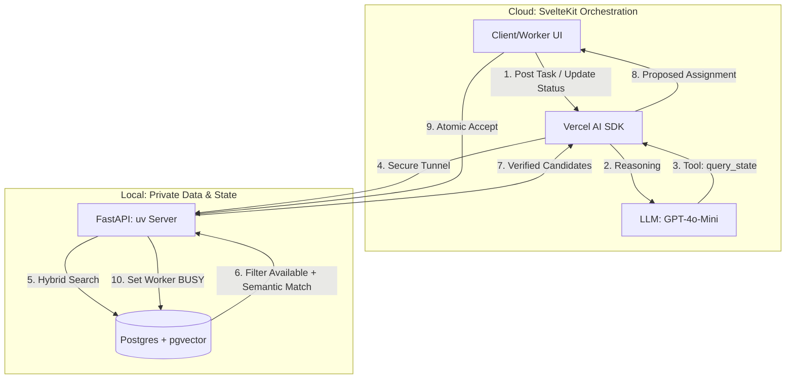

# Agentic-System (Hybrid Dispatch POC)

**A Real-Time, Privacy-First Agentic System for Dynamic Task-Worker Matching.**

- **The Project:** A dynamic dispatch engine that matches Clients' tasks to the best available Workers using semantic intelligence.
- **The Engine:** Local FastAPI server managing the "Source of Truth" (Worker status & Vector embeddings).
- **The Orchestrator:** Vercel-hosted SvelteKit using the **Vercel AI SDK** to reason over system state and suggest assignments.

### 1. Hybrid Architecture & Event Flow

The system separates **Reasoning** (Cloud LLM) from **Authoritative State** (Local Postgres). This ensures the Agent always knows who is `available` before suggesting a match.



### 2. Local "Source of Truth" (Postgres + pgvector)

We combine **Relational State** (Availability) with **Vector Search** (Skills). This prevents the Agent from assigning a worker who is already busy.

**SQL Schema:**

```sql
CREATE EXTENSION IF NOT EXISTS vector;

-- Workers Table: Semantic Skills + Real-time Status
CREATE TABLE workers (
    id SERIAL PRIMARY KEY,
    name TEXT NOT NULL,
    skills_embedding vector(1536),
    status TEXT DEFAULT 'available', -- 'available', 'busy', 'offline'
    last_updated TIMESTAMP DEFAULT NOW()
);

-- Tasks Table: Tracking assignments and preventing race conditions
CREATE TABLE tasks (
    id SERIAL PRIMARY KEY,
    description TEXT,
    required_skills TEXT,
    status TEXT DEFAULT 'open', -- 'open', 'assigned', 'completed'
    assigned_worker_id INTEGER REFERENCES workers(id)
);

```

### 3. The "Vault" API (FastAPI + Pydantic AI)

We use **Pydantic AI** tools to allow the Agent to "see" inside the local database.

**Hybrid Search Logic:**

```python
@agent.tool
async def get_available_candidates(task_embedding: list[float]):
    """
    Finds the top 3 available workers using Hybrid Search.
    Filters by 'available' status in Postgres BEFORE vector similarity.
    """
    # SQL: SELECT id, name FROM workers
    #      WHERE status = 'available'
    #      ORDER BY skills_embedding <=> :task_embedding LIMIT 3
    return candidates

```

### 4. Critical Design Principles

| Strategy            | Implementation                                                  | Benefit                                                                                |
| ------------------- | --------------------------------------------------------------- | -------------------------------------------------------------------------------------- |
| **Hybrid Search**   | Filter `status = 'available'` in SQL _before_ the vector match. | **Precision:** Prevents the LLM from hallucinating assignments for busy workers.       |
| **Atomic Claiming** | `UPDATE tasks SET worker_id = X WHERE worker_id IS NULL`.       | **Safety:** Prevents "Race Conditions" where two workers claim the same task.          |
| **State Awareness** | Agent must call `get_available_candidates` tool every time.     | **Real-time:** Ensures the Agent uses the latest updates before generating a response. |
| **Local Vault**     | All PII (Names, Bios, Skill vectors) stays on local hardware.   | **Privacy:** Only minimal candidate IDs are sent to the Cloud LLM.                     |

### 5. Setup Instructions

**1. Local Infrastructure (`uv`):**

```bash
mkdir backend && cd backend
uv init
uv add fastapi uvicorn pgvector psycopg[binary] pydantic-ai
# Run local Postgres with pgvector (Docker)
docker run --name local-vdb -e POSTGRES_PASSWORD=pass -p 5432:5432 -d pgvector/pgvector:pg17

```

**2. Vercel Deployment:**

- Deploy SvelteKit to Vercel.
- Use **ngrok** or **Cloudflare Tunnel** to point `LOCAL_VAULT_URL` to your FastAPI server.
- Configure `maxSteps: 5` in the Vercel AI SDK to allow the Agent to perform the "Search → Reason → Assign" loop.

### 6. User Experience Flow

1. **Client** posts a task through SvelteKit.
2. **Agent** (Vercel) queries **Local Vault** for the best _available_ matches.
3. **Agent** presents the top match to the **Worker**.
4. **Worker** clicks "Accept" $\rightarrow$ **FastAPI** atomically marks worker as `busy` and task as `assigned`.
