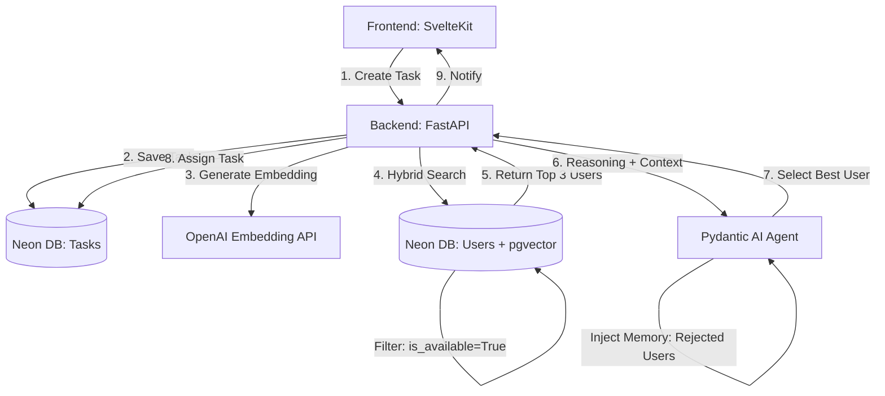

# Agentic-System (POC)

**Event-driven Agentic system for Intelligent Task-User Matching.**

* **The Project:** Automatically retrieving the best **User Profile** to match a new **Task**.
* **The Agent:** A Pydantic AI "Brain" that evaluates the Top 3 candidates and decides who is best, providing a clinical reasoning for the choice.
* **The Tech:** SvelteKit + FastAPI + Pydantic AI + Neon (pgvector).

### 1. The High-Performance Architecture

To maximize performance and minimize token costs, we use a **"Retrieve then Reason"** pattern. We do not ask the LLM to search; we use the database for high-speed retrieval and the LLM for final judgment.

### 2. Database Schema !(Neon + pgvector)[https://console.neon.tech/app/projects/fancy-poetry-23803082?database=neondb]

We utilize `pgvector` for semantic similarity. **Crucially, we index availability to perform Hybrid Search.**

---

### 3. Backend: FastAPI + Pydantic AI

The Agent is restricted to a strict Pydantic schema to prevent hallucinations and ensure the Frontend receives clean data.

**Key Refinement: Agentic Memory.** We pass `rejected_user_ids` to the Agent so it learns from previous failed matches.

### 4. Optimization Strategy (Architect's Advice)

| Strategy | Implementation | Benefit |
| --- | --- | --- |
| **Hybrid Search** | Filter `is_available = True` in SQL *before* the vector search. | **Performance:** Reduces the search space and prevents the Agent from picking unavailable users. |
| **Background Embedding** | Use FastAPI `BackgroundTasks` to generate embeddings when a user updates their bio. | **Cost:** Embeddings are generated once, not on every task query. |
| **Mini Models** | Use `gpt-4o-mini` for reasoning and `text-embedding-3-small` for vectors. | **Savings:** Reduces costs by ~90% compared to using standard GPT-4. |
| **Agentic Memory** | Store `rejected_user_ids` in the Task table. | **Reliability:** Prevents the system from getting stuck in a loop of re-assigning rejected users. |

### 5. Frontend: SvelteKit

* **Real-time Updates:** Use Svelte stores to track task status.
* **Human-in-the-loop:** Instead of "Auto-Assign," the UI shows an "Agent Recommendation." The task only moves to `assigned` when the User clicks **Accept**.

