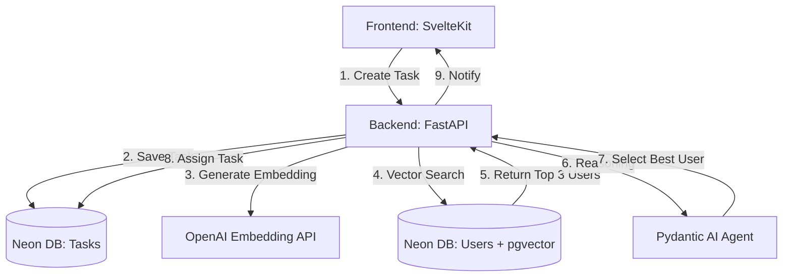

# agentic-system

Event driven agentic system to be adapted by other project

- **This Project** Retrieving **User Profiles** to match a **Task**.
- **The Agent** The brain that looks at the Task + The Top 3 Matched Users and decides _who_ is best, explaining why.

The **High-Performance, Low-Cost Architecture** designed specifically for this stack.

---

### 1. The Architecture

To save cost and performance, we will **not** ask the LLM to search the whole database. LLMs are slow and expensive. We will use RAG inside the Database for searching and the LLM for deciding.

#### **Why this architecture saves Money & Time:**

1.  **Embeddings are Cheap:** Converting text to numbers costs fractions of a cent. We do this for every task.
2.  **Vector Search is Fast:** PostgreSQL (Neon) with `pgvector` can search thousands of users in milliseconds. We don't pay the LLM to read every user profile.
3.  **LLM is the Judge, not the Searcher:** We only send the **Top 3 candidates** to the LLM. This keeps token usage low and reduces hallucinations.

---

### 2. Database Schema (Neon + pgvector)

Neon is Serverless PostgreSQL. It supports `pgvector` natively.
**SQL Setup (Run this in Neon SQL Editor):**

---

### 3. Backend: FastAPI + Pydantic AI

We will use **Pydantic AI** because it enforces structure. We want it to return a specific User ID and a Reason.

---

### 4. Frontend: SvelteKit

Keeping it simple. we need two pages:

1.  **Create Task:** A text area to submit "Gardening", "Cooking", etc.
2.  **Task Dashboard:** Polls the API to see if the Agent has assigned a user yet.

---

### 6. Optimization Checklist (Architect's Advice)

1.  **Pre-compute User Embeddings:**
    - _Don't_ generate user embeddings every time a task comes in.
    - _Do_ generate the embedding when a User registers or updates their profile. Save it in the `profile_embedding` column. This makes the search instant.
2.  **Model Selection:**
    - Use `text-embedding-3-small` for embeddings (Cheap & Fast).
    - Use `gpt-4o-mini` for the Agent (Cheap & Smart enough for matching).
    - Avoid `gpt-4o` for this POC; it's 10x more expensive and unnecessary for simple matching.
3.  **Human in the Loop (Future Step):**
    - Currently, the Agent auto-assigns.
    - **Next Version:** Changing the status to `pending_acceptance`. Send an email to the user. If they click "Accept", _then_ update the DB. This prevents the Agent from forcing work on unwilling users.
