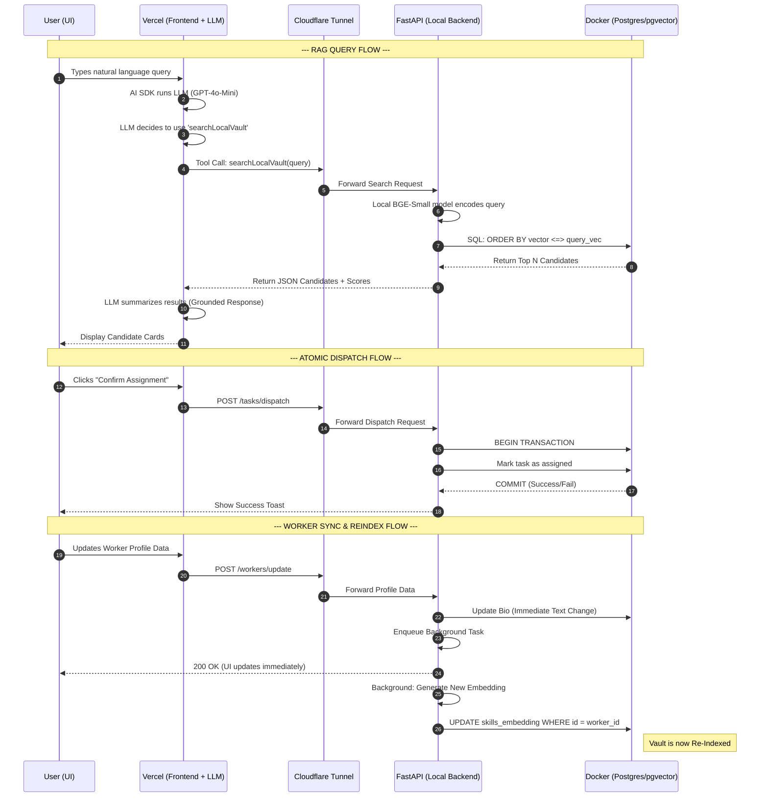

## **concise flow**

- **User query (UI):** User types a natural query on the `/query` page or sends a task via the chat UI.
- **LLM orchestration (frontend):** The Vercel AI SDK (in +server.ts) runs the LLM and exposes a tool `searchLocalVault` that must be called to fetch candidates.
- **Tool call → Vault (proxy):** The frontend tool calls the server proxy or directly the local vault URL (env `LOCAL_VAULT_URL`) which forwards to the FastAPI vault.
- **Embedding + retrieval (backend):** FastAPI (main.py) uses the startup‑cached SentenceTransformer model to:
    - Encode the incoming natural language query to an embedding.
    - Run a hybrid SQL search against Postgres+pgvector: first filter (e.g., `WHERE status='available'`) then order by vector similarity (`ORDER BY skills_embedding <=> <query>::vector`) and return top N results.
- **Return candidates:** Backend returns top matches with similarity scores (we convert distance → score_percent).
- **LLM generates grounded response:** The LLM receives the concrete candidate list and generates a summary/suggestion based only on those results (reduces hallucination).
- **User confirms:** UI shows candidate cards; when user clicks Confirm, the frontend posts to `/api/dispatch` (server proxy) → backend `/tasks/dispatch`.
- **Atomic assignment:** `POST /tasks/dispatch` (and `POST /tasks/claim`) perform atomic DB transactions to create the task, set `worker_id`, and mark the worker `busy`—this prevents race conditions.
- **Worker update & reindex:** When a worker profile is changed via `POST /workers/update`, the backend updates the text immediately and enqueues a background task to recompute the embedding using the same local model and write it back to `skills_embedding`. So updates get re‑embedded automatically.

---

### **How to read this diagram:**

1. **The RAG Loop (1-10):** Notice how the LLM doesn't just guess. It pauses, asks the local backend for data, and only speaks once it has the "Ground Truth" from your Docker Vault.
2. **The Tunnel (T):** This acts as the secure gatekeeper. Every request from the cloud must pass through here to reach your local machine.
3. **Atomic Dispatch (11-15):** The "Begin Transaction" step in Docker is what prevents two users from hiring the same worker at the exact same millisecond.
4. **Async Re-indexing (16-22):** This is the "Auto-Sync" part. We update the text immediately so the user sees their change, but we calculate the math (embedding) in the background so the server doesn't lag.

**Key components / files**

- Backend: main.py (startup cached model, `/workers/query`, `/workers/update`, `/tasks/match`, `/tasks/dispatch`, `/tasks/claim`), seed_workers.py (initial embeddings)
- DB: Postgres + `pgvector` extension, `skills_embedding vector(384)` column
- Frontend: `/query` page and `/update-worker` page, +server.ts and +server.ts proxy routes, chat handler +server.ts
- Env: `LOCAL_VAULT_URL` points to your FastAPI vault (tunnel or localhost)

**Why this design helps**

- Privacy: PII and embedding store stay local (no sending full profiles to cloud).
- Cost: embeddings are computed locally (no per-request paid embeddings).
- Freshness & safety: we filter by `status='available'` before similarity to avoid suggesting busy workers; atomic DB transactions avoid race conditions.
- Explainability: LLM summarizes actual returned records rather than inventing them.
