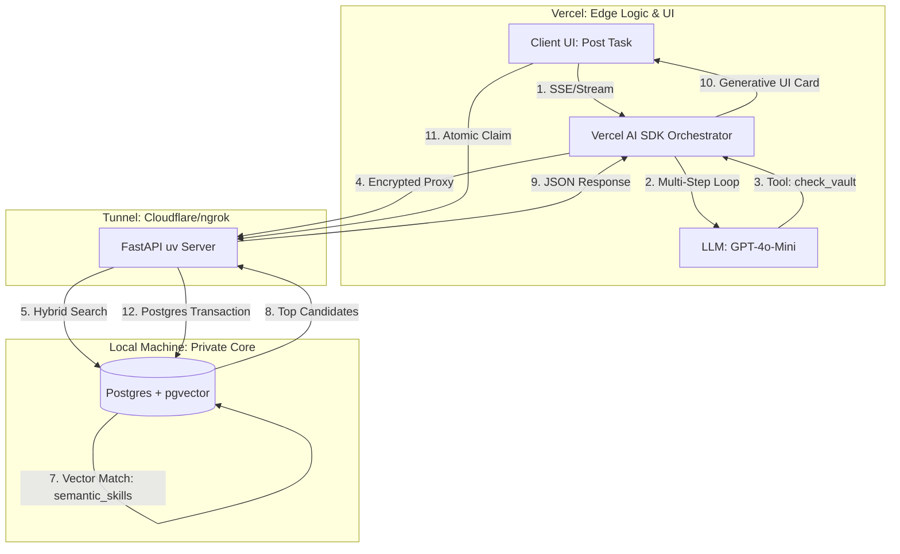

Since we are in **March 2026**, the architecture we’ve built leverages the "Hybrid-Agentic" standard: **Local Private Data** (FastAPI/uv) connected to **Edge Orchestration** (Vercel/SvelteKit).

This final blueprint shows how your project handles a task from the moment a client posts it to the moment a worker accepts it.

### **The "Dispatch Master" Architecture (Level 3)**

---

### **Component Breakdown**

| Layer             | Technology            | Role in Your Project                                                                                                      |
| ----------------- | --------------------- | ------------------------------------------------------------------------------------------------------------------------- |
| **Frontend**      | **SvelteKit 5**       | Provides a real-time dashboard. Uses `useChat` to show the Agent’s "thinking" process (tool calls).                       |
| **Orchestration** | **Vercel AI SDK 6.0** | The "Brain." It executes a loop: _Ask Local DB_ → _Analyze results_ → _Propose match_.                                    |
| **Tunnel**        | **Cloudflare Tunnel** | Bridges the gap. It makes your `localhost:8000` visible to Vercel without opening dangerous ports on your router.         |
| **Backend**       | **FastAPI (uv)**      | The "Guard." It manages the logic of checking who is busy and performing the **Atomic Update** to prevent double-booking. |
| **Vector DB**     | **pgvector (Docker)** | The "Memory." It stores worker skills as numbers (vectors) for high-speed semantic matching.                              |

---

### **The Final "User Journey"**

1. **Submission:** A Client types: _"I need an AWS expert to fix a VPC issue."_
2. **Embedding:** FastAPI converts that sentence into a vector of 1536 numbers.
3. **Hybrid Search:** Postgres finds workers who have "Cloud/AWS" skills **AND** currently have `status = 'available'`.
4. **Agentic Reasoning:** The Vercel Agent looks at the top 3 candidates, sees that "Worker A" has a higher rating for VPC specifically, and chooses them.
5. **Generative UI:** SvelteKit displays a "Worker Profile Card" to the Client and sends a notification to the Worker.
6. **Atomic Claim:** The Worker clicks **"Accept"**. FastAPI runs a single SQL command:

- _Update Task status to 'Assigned' ONLY IF it is currently 'Open'._ \* This ensures that if the Client cancels or another worker was faster, no errors occur.
